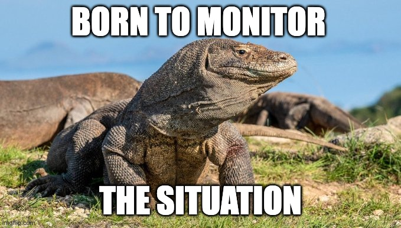

# situation-monitor

A simple app that generates memes based on the situation a Twitter user is monitoring.



# run locally
- install wasp
```bash
curl -sSL https://get.wasp.sh/installer.sh | sh
```

- start the dev server (you need docker installed)
```bash
wasp db start
```

```bash
wasp db migrate-dev
```

- start the app
```
wasp start
```

Check out the [Wasp docs](https://wasp.sh/docs) for more information.